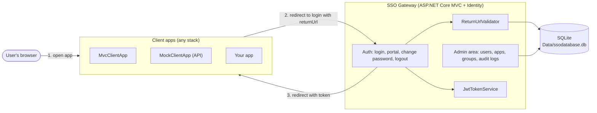
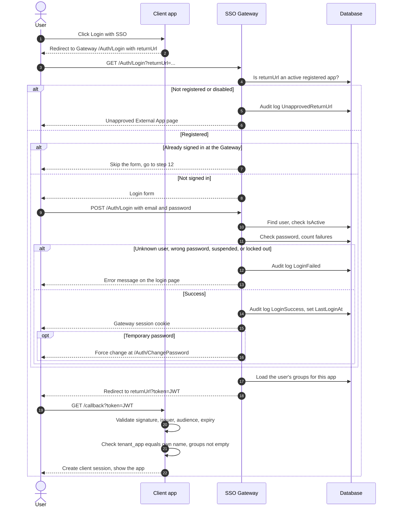
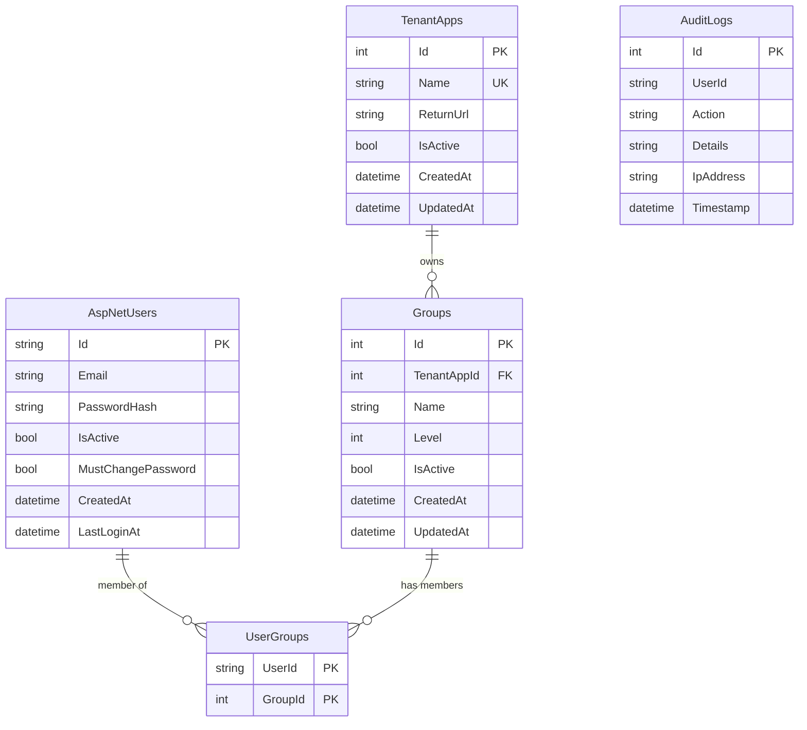

# Architecture

This page describes how the SSO system is built and how a login travels through it. For a shorter introduction, start with the [documentation overview](README.md).

The diagrams use [Mermaid](https://mermaid.js.org/), which GitHub renders automatically.

## 1. System overview

The Gateway is the only component that knows passwords. Client apps never see credentials: they receive a signed token and decide what the user may do from its claims.

## 2. Components

| Component | Project | Responsibility |
|---|---|---|
| Auth controller | `Gateway` | Login form, credential check, portal (app chooser), forced password change, logout |
| Admin area | `Gateway/Areas/Admin` | Manage users, tenant apps, groups, user-group assignments; view audit logs. Restricted to the `Admin` role |
| `JwtTokenService` | `Gateway/Services` | Builds and signs the JWT for one user and one app |
| `ReturnUrlValidator` | `Data` | Accepts a return URL only if it matches an **active** registered tenant app |
| `AuditService` | `Data` | Writes login and admin events to `AuditLogs` |
| `SeedData` | `Data` | Creates the `Admin` role, the default admin, and the demo apps on startup |
| `SsoDbContext` | `Data` | EF Core context on top of ASP.NET Core Identity |
| Client apps | `MVC`, `SsoClientApi` | Redirect to the Gateway, validate the returned token, keep their own session |

### Default addresses

| App | https | http |
|---|---|---|
| Gateway | 7281 | 5099 |
| MVC (`MvcClientApp`) | 7180 | 5345 |
| SsoClientApi (`MockClientApp`) | 7080 | 5245 |

## 3. Login flow

### What happens at each stage

1. **Return URL check.** The Gateway looks for a tenant app that is active and whose registered Return URL equals the `returnUrl` value (case-insensitive, trimmed). No match means the "Unapproved External App" page, and the attempt is audited. The check runs again when the form is posted.
2. **Credentials.** The Gateway finds the user by email. Unknown and suspended accounts are rejected; the message for a suspended account is "Account Suspended". The password is checked with Identity's lockout enabled: 5 failed attempts lock that account for 15 minutes.
3. **Session at the Gateway.** On success the Gateway sets its own cookie (`SSO.Gateway`, 9 hours, not sliding). While that cookie is valid, any other app that sends the user to the Gateway gets a token immediately, without showing the form.
4. **Temporary passwords.** If the user has `MustChangePassword` set (new account or admin reset), every page except change-password and logout redirects there first. After a successful change the flow continues to the app.
5. **Token issue.** The Gateway loads only the user's groups that belong to the requested app, builds the JWT, and redirects to the **registered** Return URL from the database (never to text supplied in the request) with `?token=<jwt>` appended.
6. **Client validation.** The client verifies the token itself using the shared secret. It must also confirm the `tenant_app` claim is its own name. See [jwt-claims.md](../jwt-claims.md) for the full list of checks.

### Visiting the Gateway directly

When there is no `returnUrl`, a successful login goes to the **Portal** (`/Auth/Portal`):

- An **admin** sees a chooser of apps and a link to the admin area.
- A regular user with access to **exactly one** app is sent straight to it with a token.
- A regular user with several apps sees a chooser. Picking one calls `/Auth/Launch/{id}`, which is audited as `AppLaunch`.

A non-admin who opens the admin area is redirected to the Portal.

### Logout

Logout is "single": the client clears its own session and then sends the browser to the Gateway's `/Auth/Logout`, which clears the Gateway session.

> **Limitation:** tokens are validated locally by each client and are not tracked by the Gateway. Suspending a user or logging out stops **new** logins, but a token that was already issued stays valid in the client until its `exp` (up to 9 hours).

## 4. Data model

Notes:

- **Users** are ASP.NET Core Identity's `AspNetUsers` table, extended by `ApplicationUser` with `IsActive`, `MustChangePassword`, `CreatedAt`, and `LastLoginAt`. Emails must be unique. Roles use Identity's own tables; the `Admin` role gates the admin area.
- **TenantApps**: `Name` is unique. `IsActive` lets an admin disable an app without deleting it.
- **Groups**: a group name is unique **within its app** (unique index on `Name` + `TenantAppId`). `Level` is nullable; the token service treats a missing level as `99`. Lower is more powerful, and `0` is the highest.
- **UserGroups** is the many-to-many link between users and groups, with a composite primary key, so a user cannot be assigned to the same group twice. A user can belong to many groups across different apps.
- **AuditLogs** has no foreign key. `UserId` is a plain nullable column, so a log row survives even when the account is gone or was never found (for example, a failed login for an unknown email).

### Audit events

The Gateway writes these `Action` values today:

| Action | When |
|---|---|
| `LoginSuccess` | Credentials accepted |
| `LoginFailed` | Unknown user, wrong password, suspended account, or lockout. Includes the reason and the IP address |
| `UnapprovedReturnUrl` | A request used a return URL that is not registered or is disabled |
| `AppLaunch` | A user opened an app from the Portal chooser |
| `PasswordChanged` | A user replaced their temporary password |
| `PasswordReset` | An admin reset a user's password |
| `UserCreated` | An admin created a user |
| `AdminGranted` / `AdminRevoked` | An admin gave or removed the `Admin` role |

## 5. Security controls

| Control | Where it is enforced |
|---|---|
| Only registered, active apps may use the login page | `ReturnUrlValidator`, on both GET and POST of the login |
| Redirects go to the stored Return URL, not to request text | `AuthController` when issuing the token |
| No public sign-up | There is no registration page. Admins create accounts |
| Duplicate emails blocked | Identity `RequireUniqueEmail` |
| Lockout after 5 failed attempts for 15 minutes | Identity lockout (`AuthSecurityOptions`). This is **per account**, not per IP address |
| Suspended accounts cannot log in | `IsActive` check at login and at the Portal |
| Admin area restricted to admins | `[Authorize(Roles = "Admin")]` on every admin controller |
| CSRF protection | Antiforgery token required on every POST in the Gateway |
| Token for app A rejected by app B | `tenant_app` claim check in each client |
| Token integrity | HS256 signature, issuer, audience, and expiry checked by the client |
| Temporary password must be replaced | Middleware redirects to change-password until `MustChangePassword` is cleared |
| Cross-origin calls limited | CORS allow-list (`Cors:AllowedOrigins`) |
| Secrets kept out of the repository | Signing key and default admin password come from user-secrets |

### Things to be aware of

- The token travels in the **query string** of the callback URL, so it can appear in browser history and server logs. Clients should validate it and redirect to a clean URL right away, as the sample `MVC` app does.
- All client apps share **one** signing key. Anyone holding it could forge tokens for any app, so treat it as a secret and use a different value outside the classroom.

## 6. Where to look in the code

| Topic | File |
|---|---|
| Startup, Identity, cookies, CORS, password-change gate | `Gateway/Program.cs` |
| Login, portal, logout, change password | `Gateway/Controllers/AuthController.cs` |
| Token creation | `Gateway/Services/JwtTokenService.cs` |
| Lockout settings | `Gateway/Services/AuthSecurityOptions.cs` |
| Return URL check | `Data/ReturnUrlValidator.cs` |
| Audit writing | `Data/AuditService.cs` |
| Schema and relationships | `Data/SsoDbContext.cs`, `Data/Migrations/` |
| First-run data | `Data/SeedData.cs` |
| Client-side validation (MVC) | `MVC/Services/SsoSupport.cs`, `MVC/Controllers/AccountController.cs` |
| Client-side validation (API) | `SsoClientApi/Program.cs`, `SsoClientApi/SsoSupport.cs` |
